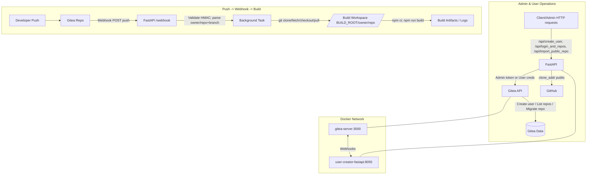

# Gitea + FastAPI Webhooks: High-Level Architecture

This document explains the moving parts of the `user-creator-fastapi` app and how it integrates with Gitea to automate user/repo operations and build steps on push events.

## Components

- **Gitea** (`gitea/docker-compose.yml` → service `gitea-server`)
  - Source control, webhook sender.
  - Exposes HTTP API at `http://gitea-server:3000` inside the Docker network (or `http://192.168.1.11:3033` from host).
- **FastAPI service** (`gitea/user-creator-fastapi/`)
  - REST API to administer users and repos via Gitea API.
  - Webhook endpoint `/webhook` to receive push events.
  - Triggers local build steps (git pull/clone, npm ci, npm run build).
- **Build workspace** (`/srv/builds`)
  - Working tree for each repo that gets built on push, e.g. `/srv/builds/<owner>/<repo>`.
- **Helper scripts** (`gitea/user-creator-fastapi/scripts/`)
  - `gitea-verify-and-test.sh`: Verify API/token/repo/webhook and trigger Gitea’s webhook test.
  - `build-and-dev.sh`: On-demand helper to run `npm ci`/`npm run build` (and optional `npm run dev`) for a given path.

## Network & Deployment

- Both `gitea-server` and `user-creator-fastapi` services join the same Compose network `gitea`.
- FastAPI runs on port `8055` and is reachable:
  - Inside the Docker network: `http://user-creator-fastapi:8055`
  - From the host: `http://127.0.0.1:8055` (published via ports)
- Recommended internal webhook URL in Gitea: `http://user-creator-fastapi:8055/webhook`

## Environment Variables (FastAPI)

- `GITEA_BASE`: Base URL to Gitea API (inside network: `http://gitea-server:3000`)
- `GITEA_TOKEN`: Admin token used by FastAPI to call the Gitea API
- `WEBHOOK_SECRET`: Shared secret configured in the Gitea webhook; used to validate `X-Gitea-Signature`
- `BUILD_ROOT`: Path for working trees (default `/srv/builds`)
- `REPO_MAP` (optional): JSON map for custom working directories per repo (e.g. `{ "owner/repo": "/var/www/repo" }`)

Defined in `gitea/user-creator-fastapi/.env` (see `.env.sample`).

## FastAPI Endpoints (Summary)

- `GET /health` – health probe.
- `GET /` + static – simple UI.
- `POST /api/create_user` – create a Gitea user (admin token required).
- `POST /api/login_and_repos` – list a user’s owned repos using their credentials.
- `POST /api/import_public_repo` – import (migrate) a public Git repo into a user’s account.
- `POST /webhook` – receives Gitea push events (HMAC verified), kicks off background build.

See implementation in `gitea/user-creator-fastapi/main.py`.

## Webhook Flow (Push → Build)

1. A push happens on a Gitea repo.
2. Gitea sends webhook to `POST /webhook` with headers:
   - `X-Gitea-Event: push`
   - `X-Gitea-Signature: <hex HMAC-SHA256 of body with WEBHOOK_SECRET>`
3. FastAPI validates signature and parses the payload for `repository.full_name` and branch (`ref`).
4. FastAPI schedules `run_build(owner/repo, branch)` as a background task:
   - Clone if needed under `BUILD_ROOT/owner/repo`.
   - `git fetch/checkout/pull` to the branch.
   - `npm ci` and `npm run build` (logs are printed to app logs).

Notes:
- If the repo is private, configure clone authentication (e.g., internal HTTP with token or SSH). Current default uses unauthenticated HTTP.
- Logs for each step include command, stdout/stderr (truncated), and exit code.

## Admin/User Operations (FastAPI → Gitea API)

- `POST /api/create_user`
  - Uses admin token to call `POST /api/v1/admin/users`.
- `POST /api/login_and_repos`
  - Uses Basic Auth with user credentials to call `GET /api/v1/user/repos`.
- `POST /api/import_public_repo`
  - Uses admin token + `sudo=<username>` to call `POST /api/v1/repos/migrate` with a public `clone_addr`.

## Helper Script Workflows

- `scripts/gitea-verify-and-test.sh`
  - Validates: API reachable, token identity, owner, repo, webhook presence.
  - Auto-selects `HOOK_ID` (or respects `WEBHOOK_URL`).
  - Triggers webhook test delivery (HTTP 204 from Gitea API means scheduled). Check FastAPI logs and Gitea’s Recent Deliveries for 200/401.

- `scripts/build-and-dev.sh`
  - One-off build for a given project path: `npm ci` (unless `--skip-ci`) and `npm run build`.
  - `--dev` keeps running the repo’s dev server in the foreground.
  - This script does not “listen”; listening is handled by FastAPI `/webhook`.

## Typical End-to-End Setup

1. `docker compose up -d` for `gitea-server`, `gitea-db`, and `user-creator-fastapi`.
2. Set webhook in the target repo to `http://user-creator-fastapi:8055/webhook` and set `WEBHOOK_SECRET`.
3. Ensure FastAPI `.env` has matching `WEBHOOK_SECRET` and `GITEA_BASE=http://gitea-server:3000`.
4. Trigger a test: `scripts/gitea-verify-and-test.sh` (expect 204 from API), verify POST /webhook and build logs.
5. On real pushes to the repo, the build runs automatically.

## Mermaid Diagram

## Troubleshooting

- No POST /webhook observed:
  - Secret mismatch → Gitea delivery shows 401.
  - Connectivity/DNS → From gitea container: `curl http://user-creator-fastapi:8055/health`.
- Build failures:
  - `npm not found` → Install Node/npm (already included in Dockerfile). Ensure PATH.
  - Private repo auth → Configure token/SSH for `git clone/fetch`.
- Internal vs Host URLs:
  - Inside network prefer `http://gitea-server:3000` and `http://user-creator-fastapi:8055`.
  - From host prefer `http://127.0.0.1:3033` (Gitea) and `http://127.0.0.1:8055` (FastAPI).
