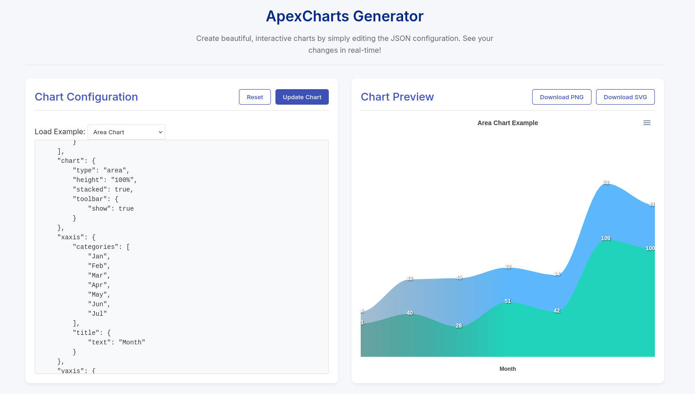

# ApexCharts Generator

A **Node.js** web application that uses **ApexCharts** to create beautiful, interactive charts from JSON configurations.

This application allows you to:

- Generate various chart types (line, bar, pie, area, donut, funnel)
- Customize charts using a simple JSON configuration
- Preview changes in real-time
- Download charts as PNG or SVG

* https://apexcharts.com/javascript-chart-demos/funnel-charts/funnel/

