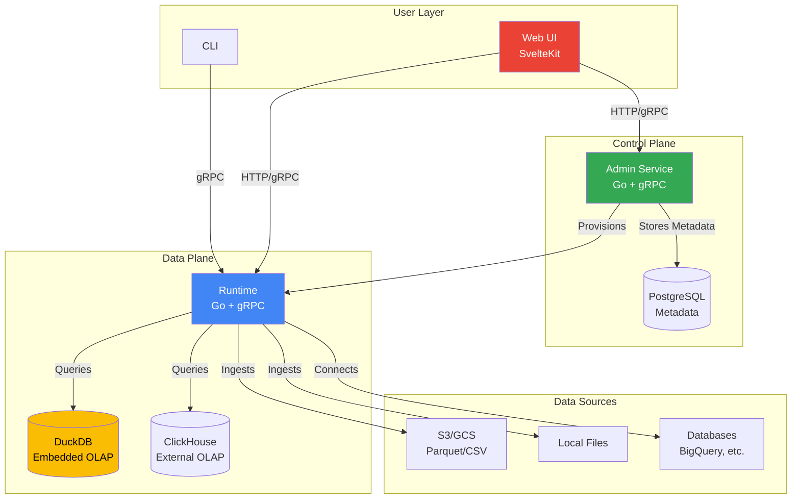

# Rill Architecture Documentation

> Last updated: January 2026

## Overview

**Rill** is a BI-as-code platform that delivers the fastest path from data lake to dashboard. It provides rapid, self-service dashboards built directly on raw data lakes, with an embedded in-memory database powered by DuckDB or ClickHouse for millisecond query performance.

### Core Value Proposition

- **For Data Engineers & Analysts**: Rapid, self-service dashboards built directly on raw data lakes, eliminating traditional BI complexity
- **For Data Consumers**: Reliable, fast-loading dashboards with accurate, real-time metrics
- **For AI Systems**: Structured, real-time data access through the metrics layer for quick and accurate AI-driven decision-making

---

## Table of Contents

- [Rill Architecture Documentation](#rill-architecture-documentation)
  - [Overview](#overview)
    - [Core Value Proposition](#core-value-proposition)
  - [Table of Contents](#table-of-contents)
  - [Design Principles](#design-principles)
  - [Technology Stack](#technology-stack)
    - [Frontend Stack](#frontend-stack)
    - [Backend Stack](#backend-stack)
    - [Data Layer](#data-layer)
    - [API Layer](#api-layer)
    - [Infrastructure](#infrastructure)
  - [Monorepo Structure](#monorepo-structure)
    - [Project Layout](#project-layout)
    - [Key Directories](#key-directories)
  - [Architecture Components](#architecture-components)
    - [1. CLI (`cli/`)](#1-cli-cli)
    - [2. Runtime (`runtime/`)](#2-runtime-runtime)
    - [3. Admin Service (`admin/`)](#3-admin-service-admin)
    - [4. Frontend Applications](#4-frontend-applications)
    - [5. Protocol Buffers (`proto/`)](#5-protocol-buffers-proto)
  - [Core Concepts](#core-concepts)
    - [BI-as-Code](#bi-as-code)
    - [Metrics Layer](#metrics-layer)
    - [AI Agent Integration](#ai-agent-integration)
  - [Deployment Configurations](#deployment-configurations)
    - [Local Development Mode](#local-development-mode)
    - [Cloud Production Mode](#cloud-production-mode)
    - [Backwards Compatibility Strategy](#backwards-compatibility-strategy)
  - [Build System](#build-system)
    - [Key Build Targets](#key-build-targets)
    - [Development Workflow](#development-workflow)
  - [Data Flow Architecture](#data-flow-architecture)
  - [API Architecture](#api-architecture)
  - [Testing Strategy](#testing-strategy)
  - [Development Setup](#development-setup)
    - [Prerequisites](#prerequisites)
    - [Quick Start](#quick-start)
  - [Example Use Cases](#example-use-cases)
  - [Additional Resources](#additional-resources)

---

## Design Principles

Rill is built around six core design principles:

1. **Lightning Fast** - Powered by SvelteKit & DuckDB for conversationally fast performance
2. **Universal Data Support** - Works with local and remote datasets (Parquet, CSV, S3, GCS, HTTPS, local files)
3. **Automatic Profiling** - Build intuition about datasets through automatic profiling
4. **Real-time Response** - Responds to each keystroke by re-profiling the resulting dataset
5. **Interactive Dashboards** - Thoughtful, opinionated defaults for quick insights
6. **Dashboards as Code** - Version control, Git sharing, and easy project rehydration

---

## Technology Stack

### Frontend Stack

- **Framework**: TypeScript + SvelteKit
- **UI Components**: Svelte components with modular, reusable design
- **Build Tool**: Vite
- **Styling**: Tailwind CSS (configurable)
- **State Management**: Svelte stores
- **Testing**: Playwright (E2E), Vitest (unit tests)

### Backend Stack

- **Language**: Go 1.25+
- **CLI Framework**: Cobra (inferred from common Go CLI patterns)
- **Concurrency**: Go routines and channels for orchestration
- **API Protocols**: gRPC + gRPC-Gateway for REST

### Data Layer

- **Embedded OLAP**: DuckDB (primary, for small-to-medium data)
- **External OLAP**: ClickHouse, Apache Druid (for big data)
- **Metadata Storage**: PostgreSQL (for cloud/hosted deployments)
- **File Storage**: Local disk + cloud object stores (S3, GCS)

### API Layer

- **Protocol**: gRPC with HTTP/REST gateway via gRPC-Gateway
- **Schema Definition**: Protocol Buffers (`.proto` files)
- **OpenAPI Generation**: Auto-generated from Protocol Buffers
- **Code Generation**: Buf for Protocol Buffer compilation

### Infrastructure

- **Containerization**: Docker
- **CI/CD**: GitHub Actions
- **Package Management**: 
  - NPM (JavaScript/TypeScript, with workspaces)
  - Go Modules (Go)
- **Release**: GoReleaser (macOS arm64/amd64, Linux amd64)

---

## Monorepo Structure

Rill uses a **monorepo** to coordinate changes across multiple components in a single PR and provide a unified codebase for contributors.

### Project Layout

```
rill/
├── .github/           # CI/CD workflows (GitHub Actions)
├── admin/             # Backend control plane (cloud/multi-user)
├── cli/               # CLI application + local frontend server
├── docs/              # User-facing documentation (docs.rilldata.com)
├── proto/             # Protocol Buffer definitions (APIs)
├── runtime/           # Data plane (engine/orchestrator)
├── scripts/           # Development utilities
├── web-admin/         # Cloud control plane frontend
├── web-common/        # Shared frontend utilities/components
├── web-local/         # Local Rill application (data modeler)
├── web-integration/   # Integration tests
├── rill-examples/     # Example projects (submodule)
├── Makefile           # Build automation
├── package.json       # NPM workspace configuration
└── go.mod             # Go module configuration
```

### Key Directories

| Directory | Purpose | Language/Tech |
|-----------|---------|---------------|
| **cli** | Command-line interface and local server | Go |
| **runtime** | Data engine (queries, reconciliation, drivers) | Go |
| **admin** | Control plane for managed deployments | Go |
| **web-local** | Local UI for data modeling and exploration | TypeScript/Svelte |
| **web-admin** | Cloud UI for project management | TypeScript/Svelte |
| **web-common** | Shared frontend code (components, utilities) | TypeScript/Svelte |
| **proto** | gRPC/OpenAPI schema definitions | Protocol Buffers |
| **docs** | User documentation (Docusaurus) | Markdown |

---

## Architecture Components

### 1. CLI (`cli/`)

**Purpose**: User-facing command-line interface and embedded local server

**Key Responsibilities**:
- Project initialization and management (`rill start`, `rill init`)
- Embedding the local web application (SPA)
- Embedding example projects
- Serving the local UI in production mode

**Structure**:
```
cli/
├── cmd/          # Command definitions (start, init, deploy, etc.)
├── pkg/          # Shared packages
│   └── web/      
│       └── embed/  # Embedded web-local SPA
├── main.go       # Entry point
└── README.md     # CLI documentation
```

**Build Process**:
- Production: Embeds `web-local` SPA and examples from `rill-examples`
- Development: Serves dummy frontend, no embedding

### 2. Runtime (`runtime/`)

**Purpose**: Data infrastructure proxy and orchestrator (the "data plane")

**Key Responsibilities**:
- Dashboard queries execution
- Parsing code files (SQL models, YAML configs)
- Reconciling infrastructure state
- Implementing connectors to data sources
- Enforcing row-based access policies
- Scheduling tasks (ingestion, alerts, reports)

**Modular Design**: Can be embedded in local applications or deployed standalone in the cloud.

**Structure**:
```
runtime/
├── drivers/      # Interfaces for DuckDB, ClickHouse, Druid, S3, etc.
├── metricsview/  # Metrics layer (metrics -> SQL conversion)
├── parser/       # Rill project file parser
├── queries/      # Analytical query implementations
├── reconcilers/  # State reconciliation logic
├── resolvers/    # Unified query resolution interface
├── server/       # gRPC server implementation
├── storage/      # File storage abstraction (disk, object store)
├── ai/           # AI integration utilities
└── testruntime/  # Test helpers
```

**Key Features**:
- **Drivers**: Abstracts interactions with DuckDB, ClickHouse, Druid, S3, GCS, BigQuery, etc.
- **Reconcilers**: Continually reconcile desired state (from code) with actual state (in data systems)
- **Metrics Layer**: Converts high-level metric definitions (YAML) into optimized SQL queries

### 3. Admin Service (`admin/`)

**Purpose**: Control plane for managed, multi-user Rill (cloud deployments at `ui.rilldata.com`)

**Key Responsibilities**:
- User authentication and authorization
- Project and organization management
- Billing integration
- GitHub integration (webhooks, OAuth)
- Deployment provisioning
- Runtime orchestration

**Structure**:
```
admin/
├── database/     # PostgreSQL schema and migrations
├── server/       # gRPC server implementation (admin APIs)
├── billing/      # Billing/subscription logic
├── jobs/         # Background job processing
├── provisioner/  # Runtime provisioning logic
└── pkg/          # Shared utilities
```

**Development**:
- Runs independently from runtime in cloud deployments
- Communicates with runtime via gRPC

### 4. Frontend Applications

#### `web-local/` (Local Data Modeler)

**Purpose**: Local, single-user UI for data exploration and dashboard creation

**Features**:
- SQL model editor (Monaco)
- Data profiling and visualization
- Metrics view editor
- Interactive dashboards

**Stack**: SvelteKit, Vite, Tailwind

#### `web-admin/` (Cloud Control Plane UI)

**Purpose**: Multi-user, cloud UI for project and org management

**Features**:
- Project browsing and deployment
- User management
- Billing dashboards
- Collaboration tools

**Stack**: SvelteKit, Vite, Tailwind

#### `web-common/` (Shared Frontend Code)

**Purpose**: Reusable components, utilities, and API clients

**Contains**:
- UI components (charts, tables, forms)
- API client generation (from OpenAPI)
- Theme utilities
- Shared stores

### 5. Protocol Buffers (`proto/`)

**Purpose**: Define APIs and data structures using Protocol Buffers

**Structure**:
```
proto/
├── rill/
│   ├── admin/v1/    # Admin service APIs
│   ├── runtime/v1/  # Runtime service APIs
│   ├── local/       # Local-only APIs
│   └── ui/          # UI-specific messages
└── gen/             # Generated code (Go, TypeScript)
```

**Build Process**:
- Uses Buf for linting, breaking change detection, and code generation
- Generates Go server code (gRPC)
- Generates OpenAPI specs (v2/v3)
- Generates TypeScript clients (via `orval` from OpenAPI)

---

## Core Concepts

### BI-as-Code

Rill treats dashboards and metrics as code, enabling version control and reproducibility:

1. **SQL Models**: Define data transformations via SQL queries
2. **YAML Configuration**: Configure metrics views, dashboards, and project settings
3. **Git Integration**: Version control for analytics assets
4. **CLI Tools**: Deploy and manage from the command line

**Example Project Structure**:
```
my-rill-project/
├── rill.yaml              # Project configuration
├── sources/
│   └── orders.yaml        # Data source definition
├── models/
│   └── revenue_model.sql  # SQL transformation
└── metrics/
    └── revenue_metrics.yaml  # Metrics view definition
```

### Metrics Layer

**Purpose**: Provide a unified, standardized way to define, compute, and serve business metrics

**Components**:
- **Dimensions**: Grouping attributes (e.g., country, product_category)
- **Measures**: Aggregated metrics (e.g., total_revenue, order_count)
- **Timeseries**: Temporal dimension for time-based analysis

**Example Metrics View** (`revenue_metrics.yaml`):
```yaml
name: revenue_metrics
description: Key revenue metrics by country and product
model: revenue_model
timeseries: date
dimensions:
  - name: country
    column: country
  - name: product_category
    column: product_category
measures:
  - name: total_revenue
    expression: sum(amount)
    description: Total revenue amount
  - name: order_count
    expression: count(*)
    description: Number of orders
  - name: avg_order_value
    expression: sum(amount) / count(*)
    description: Average order value
```

**Benefits**:
- Reusable metric definitions across dashboards, APIs, and AI agents
- Consistent business logic
- Optimized SQL generation
- Real-time query execution with sub-second latency

### AI Agent Integration

Rill's metrics layer is designed for AI consumption:

- **Structured Data**: AI systems receive well-defined, typed metrics
- **Low Latency**: Embedded databases (DuckDB/ClickHouse) eliminate network overhead
- **Real-time**: Metrics are computed on-demand with fresh data
- **Semantic Layer**: Metrics have human-readable descriptions for LLM context

---

## Deployment Configurations

Rill supports two primary deployment modes:

### Local Development Mode

**Characteristics**:
- Single-process execution
- All services (CLI, runtime, UI) run together
- DuckDB for OLAP
- Local file storage
- No authentication

**Command**:

```bash
rill start my-project
```

**Use Cases**:
- Data exploration
- Dashboard prototyping
- Local development

### Cloud Production Mode

**Characteristics**:
- Multi-service architecture
- Services deployed independently (admin, runtime, UI)
- PostgreSQL for metadata
- S3/GCS for file storage
- OAuth authentication
- Dynamic runtime provisioning

**Services**:
1. **Admin Service**: User/project management, auth, billing
2. **Runtime(s)**: Dynamically provisioned per project
3. **Web UI**: Served from CDN

**Deployment Sequence** (for rollouts):
1. Admin service (must be backwards compatible with older runtime & UI)
2. Runtime(s) (must be backwards compatible with older UI)
3. Web UI (no backwards compatibility needed)

### Backwards Compatibility Strategy

During cloud rollouts, newer versions of one service may communicate with older versions of another. 

The rollout sequence ensures:
- Admin is always backwards compatible
- Runtime is backwards compatible with older UIs
- UI does not need to worry about backwards compatibility

---

## Build System

The build system is orchestrated via a `Makefile` and NPM scripts.

### Key Build Targets

| Target | Command | Description |
|--------|---------|-------------|
| **Production CLI** | `make` or `make cli` | Builds production binary with embedded UI and examples |
| **CLI Only** | `make cli-only` | Builds CLI without preparing UI/examples |
| **CLI Prepare** | `make cli.prepare` | Clones examples, builds web-local, embeds in CLI |
| **Proto Generate** | `make proto.generate` | Generates gRPC, OpenAPI, and client code from `.proto` files |
| **Docs Generate** | `make docs.generate` | Auto-generates CLI and project file reference docs |
| **Go Coverage** | `make coverage.go` | Runs Go tests with coverage reporting |

### Development Workflow

**Full Local Development**:

```bash
# Start all services (admin, runtime, UI)
rill devtool start
```

**Local Rill Application**:

```bash
# Start runtime + web server in dev mode
npm run dev

# Or just the UI (assumes runtime is running)
npm run dev-web -- --port 3001
```

**Runtime Development**:
```bash
# Start runtime server
go run ./cli runtime start
```

**Admin Development**:
```bash
# Start admin service
go run ./cli admin start
```

---

## Data Flow Architecture



**Key Flow**:
1. **User** interacts via CLI or Web UI
2. **Admin Service** (cloud only) manages users, projects, auth
3. **Runtime** executes queries, reconciles state, orchestrates data ingestion
4. **OLAP Engines** (DuckDB, ClickHouse) perform analytical queries
5. **Data Sources** provide raw data (files, databases, object stores)

---

## API Architecture

Rill uses **gRPC** for service-to-service communication and **gRPC-Gateway** to expose RESTful HTTP APIs.

**API Layers**:
1. **Admin API** (`proto/rill/admin/v1/api.proto`)
   - User management
   - Project CRUD
   - Billing operations
   - GitHub integration

2. **Runtime API** (`proto/rill/runtime/v1/api.proto`)
   - Query execution
   - Catalog operations
   - Resource reconciliation
   - Metrics view queries

3. **Local API** (`proto/rill/local/`)
   - Local-only operations (not exposed in cloud)

**Adding a New Endpoint**:
1. Define in `.proto` file
2. Run `make proto.generate`
3. Implement handler in `admin/server/` or `runtime/server/`

---

## Testing Strategy

| Layer | Tool | Location |
|-------|------|----------|
| **Frontend Unit** | Vitest | `web-common/`, `web-local/` |
| **Frontend E2E** | Playwright | `web-local/tests/`, `web-integration/` |
| **Backend Unit** | Go `testing` | `*_test.go` files |
| **Backend Integration** | Go `testing` + testcontainers | `runtime/testruntime/`, `admin/testadmin/` |
| **Coverage** | Go coverage + Codecov | `make coverage.go` |

**Running Tests**:
```bash
# Frontend tests
npm run test

# Backend tests
go test ./...

# E2E tests
npm run local-test -w web-local
```

---

## Development Setup

### Prerequisites

- **Docker** (for dependencies like PostgreSQL)
- **Node.js 20+** (use nvm)
- **Go 1.25+**
- **Buf** (Protocol Buffers)

### Quick Start

1. **Clone the repository**:
   ```bash
   git clone https://github.com/rilldata/rill.git
   cd rill
   ```

2. **Install dependencies**:
   ```bash
   npm install
   ```

3. **Build the CLI**:
   ```bash
   make
   ```

4. **Start a local project**:
   ```bash
   ./rill start my-rill-project
   ```

5. **Start full dev environment** (Rill team members):
   ```bash
   rill devtool start
   ```

---

## Example Use Cases

Rill provides production-ready examples in the [`rill-examples`](https://github.com/rilldata/rill-examples) repository:

| Use Case | Description | Live Demo |
|----------|-------------|-----------|
| **Programmatic Ads** | Bidstream data for pricing optimization (OpenRTB) | [Demo](https://ui.rilldata.com/demo/rill-openrtb-prog-ads) |
| **Cost Monitoring** | Cloud infrastructure costs + customer data analysis | [Demo](https://ui.rilldata.com/demo/rill-cost-monitoring) |
| **GitHub Analytics** | Codebase activity, contributor productivity | [Demo](https://ui.rilldata.com/demo/rill-github-analytics) |
| **App Engagement** | Conversion funnels for mobile/product teams | [Demo](https://ui.rilldata.com/demo/rill-app-engagement) |

---

## Additional Resources

- **Documentation**: [docs.rilldata.com](https://docs.rilldata.com/)
- **Installation**: [Install Guide](https://docs.rilldata.com/home/install)
- **Quickstart**: [Quickstart Tutorial](https://docs.rilldata.com/get-started/quickstart)
- **Discord**: [Join Community](https://discord.gg/2ubRfjC7Rh)
- **GitHub Issues**: [Report Bugs](https://github.com/rilldata/rill/issues)
- **Rill Guru**: [Ask Questions](https://gurubase.io/g/rill)

---

**License**: Apache License 2.0

---

*This architecture document was generated from the Rill repository structure and documentation. For the latest updates, refer to the official documentation and repository READMEs.*
