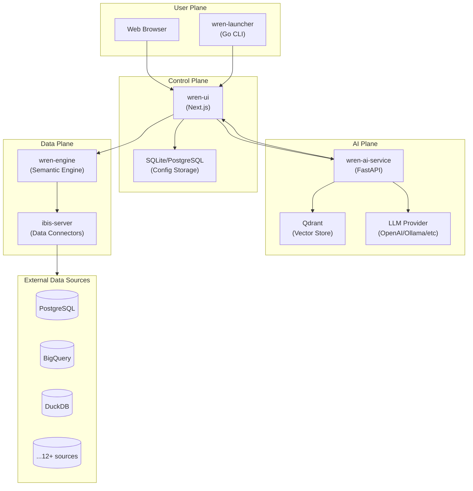
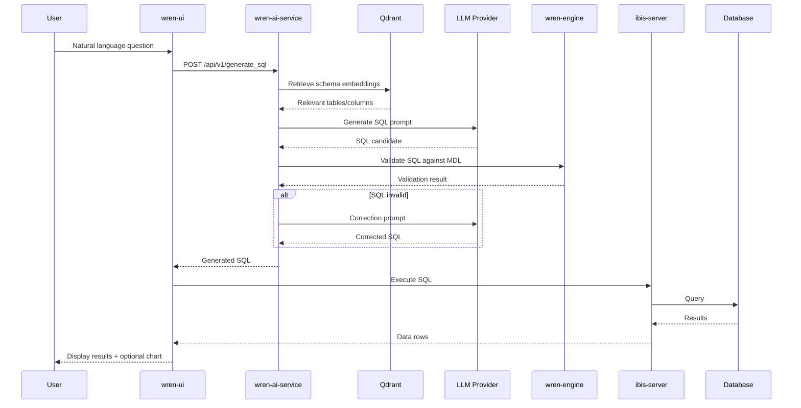

# WrenAI Architecture

> **Wren AI** is an open-source GenBI (Generative Business Intelligence) agent that enables natural language querying of databases, SQL generation, and AI-powered chart creation.

---

## System Overview

Wren AI follows a **microservices architecture** with clear separation between:
- **Control Plane**: Project configuration, UI, and user management
- **AI Plane**: LLM pipelines, embeddings, and semantic processing  
- **Data Plane**: Query execution and data source connectivity



---

## Component Breakdown

### 1. wren-ui (Control Plane)
| Aspect | Details |
|--------|---------|
| **Purpose** | Web dashboard for project setup, modeling, and chat interface |
| **Stack** | Next.js 14, TypeScript, Apollo GraphQL, Ant Design |
| **Database** | SQLite (default) or PostgreSQL for config persistence |
| **Port** | `3000` |
| **Key Features** | Semantic modeling UI, chat interface, data source configuration |

### 2. wren-ai-service (AI Plane)
| Aspect | Details |
|--------|---------|
| **Purpose** | LLM orchestration for Text-to-SQL, embeddings, and chart generation |
| **Stack** | Python 3.12, FastAPI, Haystack AI, LiteLLM |
| **Port** | `5555` |
| **Pipelines** | `indexing/`, `retrieval/`, `generation/` (42+ pipeline modules) |
| **Key Features** | Multi-LLM support, RAG retrieval, SQL correction loops |

### 3. wren-engine (Data Plane)
| Aspect | Details |
|--------|---------|
| **Purpose** | Semantic engine that understands MDL (Modeling Definition Language) |
| **Source** | External Git submodule (`github.com/Canner/wren-engine`) |
| **Port** | `8080` (HTTP), `7432` (SQL) |
| **Key Features** | Schema introspection, query validation, MDL processing |

### 4. ibis-server (Data Plane)
| Aspect | Details |
|--------|---------|
| **Purpose** | Universal data source connector using Ibis framework |
| **Stack** | Python, Ibis |
| **Port** | `8000` |
| **Supported Sources** | PostgreSQL, MySQL, BigQuery, Snowflake, DuckDB, ClickHouse, Trino, Athena, Databricks, Oracle, MSSQL, Redshift |

### 5. qdrant (AI Plane)
| Aspect | Details |
|--------|---------|
| **Purpose** | Vector database for semantic search and retrieval |
| **Version** | `v1.11.0` |
| **Ports** | `6333` (HTTP), `6334` (gRPC) |
| **Embedding Dim** | `3072` (text-embedding-3-large) |

### 6. bootstrap (Infrastructure)
| Aspect | Details |
|--------|---------|
| **Purpose** | One-time initialization of shared data volume |
| **Base Image** | `busybox` |
| **Action** | Runs `init.sh` to prepare `/app/data` |

### 7. wren-launcher (User Plane)
| Aspect | Details |
|--------|---------|
| **Purpose** | CLI tool for local installation and management |
| **Stack** | Go 1.24, Docker Compose SDK |
| **Key Features** | Interactive setup, Docker orchestration, version management |

---

## Data Flow

### Text-to-SQL Query Flow



---

## Configuration Architecture

### Environment Variables (`.env`)

| Variable | Purpose | Default |
|----------|---------|---------|
| `OPENAI_API_KEY` | LLM API authentication | Required |
| `HOST_PORT` | UI exposed port | `3000` |
| `AI_SERVICE_FORWARD_PORT` | AI service exposed port | `5555` |
| `GENERATION_MODEL` | Default LLM model | `gpt-4o-mini` |
| `TELEMETRY_ENABLED` | Usage analytics | `true` |
| `PLATFORM` | Docker platform | `linux/amd64` |

### AI Configuration (`config.yaml`)

The `config.yaml` file defines the full AI pipeline stack:

```yaml
# LLM Provider
type: llm
provider: litellm_llm
models:
  - alias: default
    model: gpt-4.1-nano-2025-04-14
    
# Embedder
type: embedder  
provider: litellm_embedder
models:
  - model: text-embedding-3-large
  
# Vector Store
type: document_store
provider: qdrant
embedding_model_dim: 3072

# Pipeline definitions (30+ pipes)
type: pipeline
pipes:
  - name: sql_generation
  - name: db_schema_retrieval
  - name: chart_generation
  # ... etc
```

---

## Supported LLM Providers

| Provider | Configuration |
|----------|---------------|
| OpenAI | `OPENAI_API_KEY` |
| Azure OpenAI | Azure credentials |
| Google Gemini | `GOOGLE_API_KEY` |
| Anthropic Claude | `ANTHROPIC_API_KEY` |
| Ollama (Local) | `OLLAMA_HOST` |
| AWS Bedrock | AWS credentials |
| Groq | `GROQ_API_KEY` |
| DeepSeek | DeepSeek credentials |
| Databricks | Databricks credentials |

---

## Build & Packaging

### Docker Images

| Image | Base | Build Type |
|-------|------|------------|
| `wren-ui` | `node:18-bookworm-slim` | Multi-stage (standalone output) |
| `wren-ai-service` | `python:3.12.0-slim-bookworm` | Multi-stage (Poetry venv) |
| `wren-engine` | External (prebuilt) | N/A |
| `ibis-server` | External (prebuilt) | N/A |
| `bootstrap` | `busybox` | Single stage |

### Monorepo Layout

```
WrenAI/
├── docker/                 # Docker Compose orchestration
│   ├── docker-compose.yaml
│   ├── .env.example
│   └── config.example.yaml
├── wren-ui/               # Next.js frontend + GraphQL API
├── wren-ai-service/       # Python AI pipelines
├── wren-launcher/         # Go CLI installer
├── wren-engine/           # Git submodule (semantic engine)
├── wren-mdl/              # MDL schema definitions
└── deployment/            # Kubernetes/Kustomize configs
```

---

## License

**AGPL-3.0** - Modifications to network-accessible deployments must be open-sourced.
